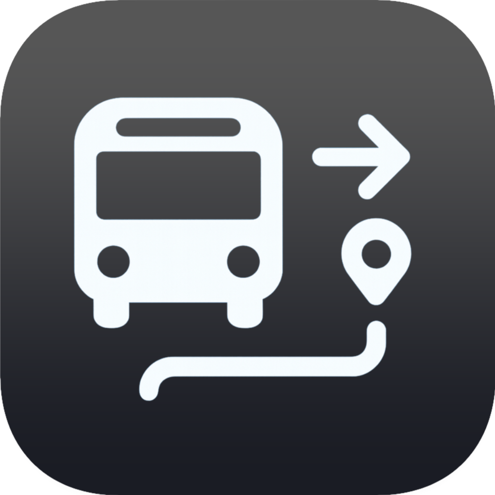

# HovaTovább  
*Készítette: Deák Levente és Stonawski Benjamin (13. B)*  

<em>Magyar tömegközlekedési menetrendtervező </em>

 

<a href="https://hova-tovabb.hu/">hova-tovabb.hu</a>
 
 
 
 
 

---

## 📖 Miről szól az alkalmazás  
A **HovaTovább** egy menetrendtervező alkalmazás, amely a magyar tömegközlekedés menetrendjeit teszi könnyen és hatékonyan elérhetővé.  
Az app képes **automatikus útvonaltervezésre**, de lehetőséget biztosít **manuális menetrend-összeállításra** is, így rugalmasan alkalmazkodik az egyéni igényekhez.  

---

## 🔗 Linkek
Weboldal: <a href="https://hova-tovabb.hu/">hova-tovabb.hu</a> 
Figma oldalak
<ul>
  <li><a href="https://eject-break-52705372.figma.site/">Benji</a></li>
  <li><a href="https://lung-cedar-76606657.figma.site">Levi</a></li>
</ul>

## 🎯 Célunk az alkalmazással  
- A legjobb alternatívát nyújtani a jelenlegi menetrendkereső alkalmazásokhoz képest  
- Valós idejű és pontos információ biztosítása  
- Felhasználóbarát, modern és megbízható megoldás a mindennapi közlekedéshez  
- Hosszú távon közösségi élménnyé tenni az útvonaltervezést manuális és személyre szabható funkciókkal  

---

## ⚙️ Főbb funkciók  

### Alapfunkciók  
- 🚏 Automatikus útvonaltervezés a magyarországi menetrendek alapján  
- ⏱️ Valós idejű adatok megjelenítése (indulási és érkezési időpontok)  
- 📱 Könnyen áttekinthető, felhasználóbarát felület  

### Egyedi funkciók  
- 🔄 **Késések kezelése**  
  Az alkalmazás figyelembe veszi a járatok valós idejű késéseit, és ennek megfelelően frissíti a találatokat.  
- ✏️ **Manuális menetrendtervezés**  
  Bejelentkezett felhasználók saját menetrendet állíthatnak össze több járat kombinálásával.  

---

## 🛠️ Használt technológiák  
- **Frontend:** Angular  
- **Backend:** Node.js  
- **Adatbázis:** MySQL  
- **API-k:** több külső API (menetrendek integrálásához, SQL adatbázis)  

---

## 🚀 Továbbfejleszthetőség  
A projekt számos bővítési lehetőséget rejt:  
- 👥 Közösségi funkciók (pl. menetrendek megosztása)  
- 🔔 Személyre szabott értesítések  
- 🚲 Alternatív közlekedési módok integrálása (bicikli, roller, gyalog)  

---

## 📌 Projekt állapota  
Ez egy iskolai projektterv, amely később akár teljes funkcionalitású alkalmazássá is fejleszthető.  

---

## 👨‍💻 Készítők  
- **Deák Levente**  
- **Stonawski Benjamin**  

---
